# Your Notes Web App

This is a notes application that runs on the locally client's browser.

## Table of contents

-  [Overview](#overview)
   -  [About the app](#about-the-app)
   -  [Screenshot](#screenshot)
   -  [Links](#links)
-  [My process](#my-process)
   -  [Built with](#built-with)
   -  [What I learned](#what-i-learned)
   -  [Continued development](#continued-development)
   -  [Useful resources](#useful-resources)
-  [Author](#author)
-  [Acknowledgments](#acknowledgments)

## Overview

### About the app

**Your Notes** is an application where a user can:

-  Create an account
-  Log in to their account
-  Create notes with the ability to mark them as complete or to delete them
-  Update their user profiles
-  View the optimal layout of the site on different devices

### Screenshot

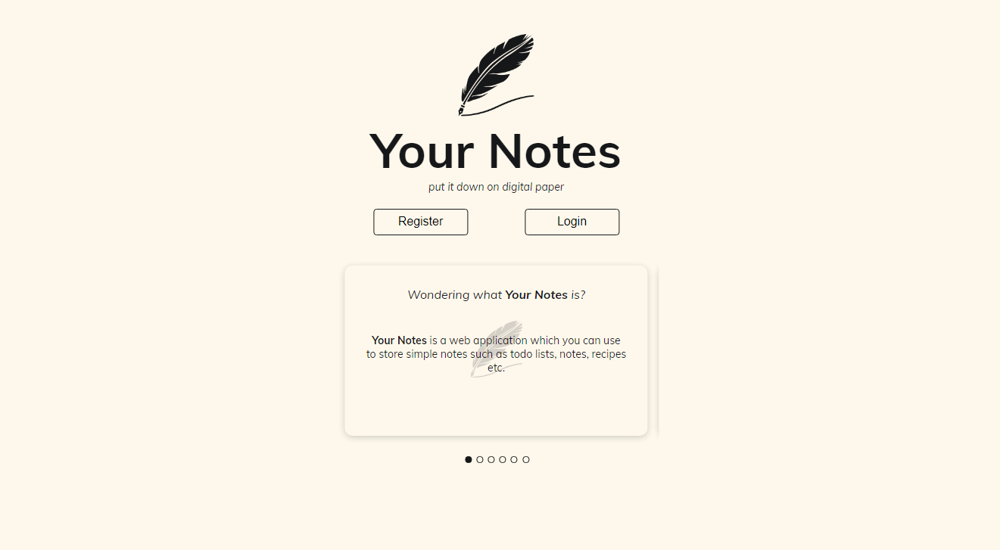

Screenshot of the **Homepage**. When you visit **Your Notes**, this is screen you'll be greeted with.

What's in view:

-  The app's logo.
-  The **Register** and **Login** buttons.
-  An introduction carousel with useful information about **Your Notes**.

---

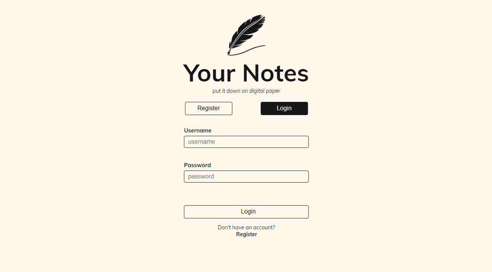

Screenshot of the **Login** page.

What's in view:

-  The login form.

---

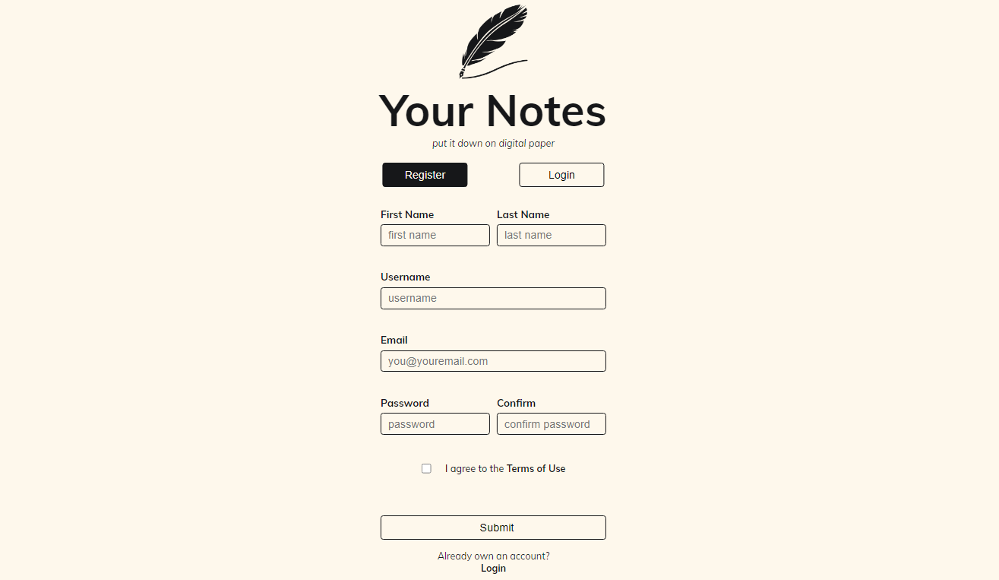

Screenshot of the **Register** page.

What's in view:

-  The registration form.

---

Screenshot of the upper part of the **Dashboard** page.

What's in view:

-  A greeting message that follows the time of day.

---

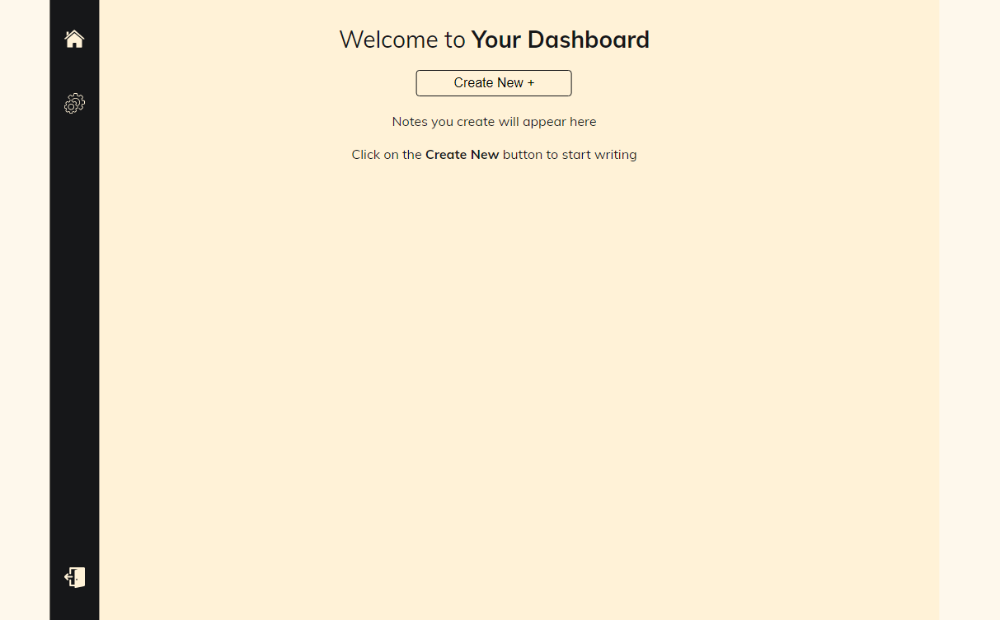

Screenshot of the lower part of the **Dashboard** page.

What's in view:

-  **Your Dashboard**. You're welcomed with this screen when you log in to the app.
-  On the right, a navigation panel that consists of a:
   -  **home** button
   -  **settings** button
   -  **logout** button

---

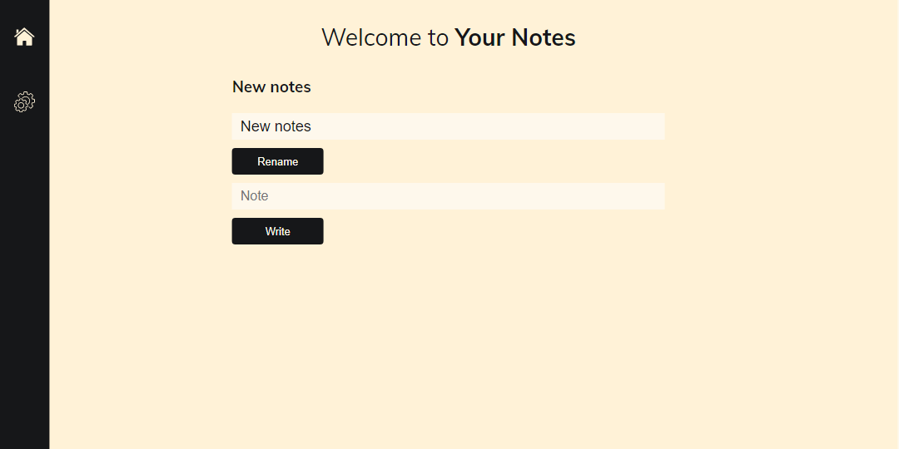

Screenshot of the **Notes** page.

What's in view:

-  **Your Notes** page.
-  Create new notes by:
   -  _renaming_ the title
   -  _writing_ notes

---

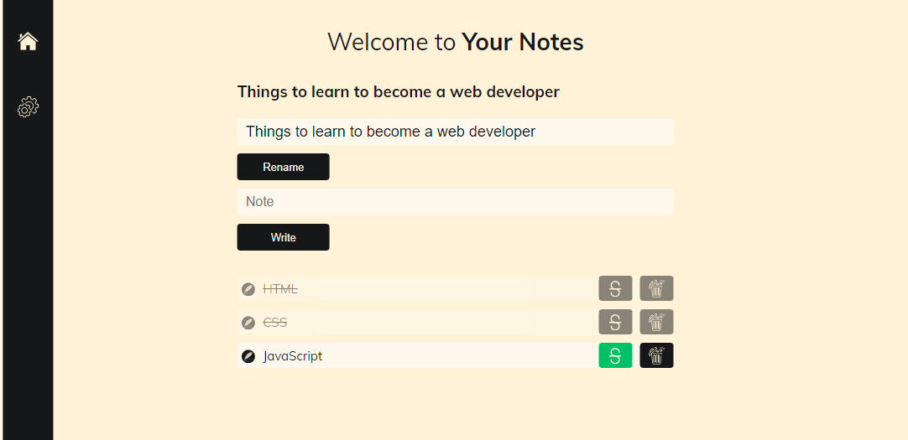

Screenshot of the **Notes** page.

What's in view:

-  Created tasks.
-  Tasks marked as _completed_ and _incomplete_

---

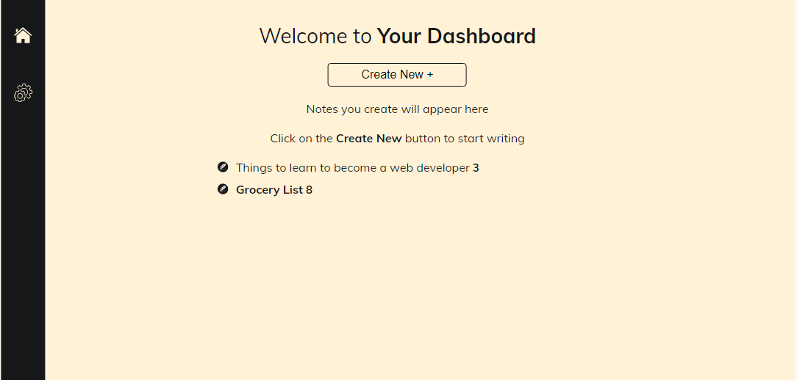

Screenshot of the **Dashboard** page.

What's in view:

-  An overview of created notes.

---

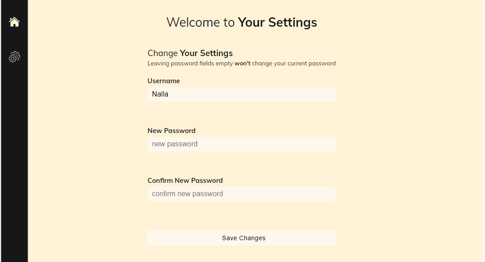

Screenshot of the **Settings** page.

What's in view:

-  The settings form.

---

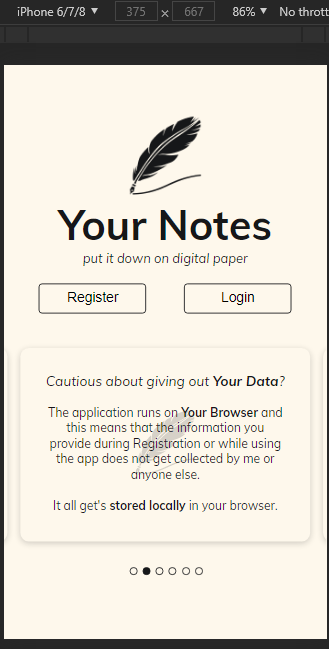
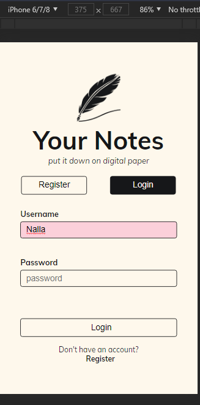
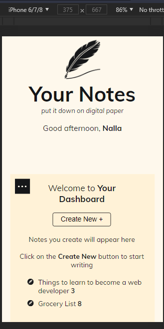
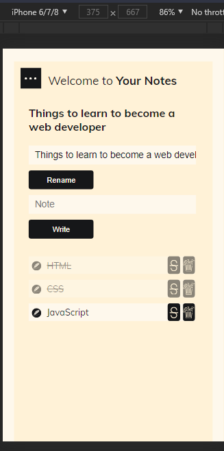
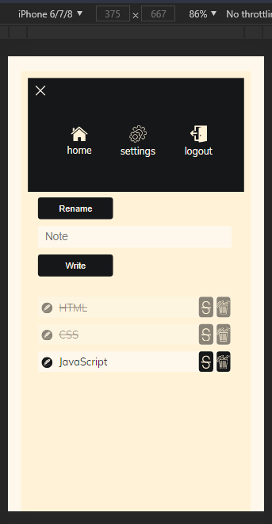

Screenshots of **Your Notes** running on mobile.

What's in view:

-  Different sections of the app as seen on mobile.

### Links

-  Live Site URL: [Your Notes](https://allankirui.github.io/YourNotes/)

## My process

### Built with

-  HTML5
-  CSS3
-  JavaScript
-  [Inkscape](https://inkscape.org)

### What I learned

-  This was the first major project I ever did. Before undertaking it, I hadn't really put my **JavaScript** skills to the test, and when I say _skills_ I mean that I was only getting started with basic **JavaScript**.
-  At that point in time, I only knew a bit on:

   -  data types
   -  variables
   -  conditional operations
   -  functions
   -  manipulating the DOM

-  I learned how to implement **functional programming** in a project and this allowed me to practice the **Do not Repeat Yourself (DRY) principle**.

### Continued development

-  Going forward, I want to **practice** what I already know by tackling more **JavaScript** focused projects. Ranging from **small** to **large** projects.

-  I also want to learn better coding practices and improve my overall skills in **Frontend Web Development**.

### Useful resources

-  [Inkscape](https://inkscape.org) - Inkscape SVG Editor. I use it all the time when I'm working on any web project. After designing this project, I used _Inkscape's_ in-built tools to figure out the _spacing_, _sizing_ and _positioning_ of elements throughout the project.

## Author

-  Github - [Allan Kirui](https://www.github.com/AllanKirui)
-  Instagram - [@nallawilljr](https://www.instagram.com/nallawilljr)

## Acknowledgments

I can't thank enough the people who helped me, in one way or another, while I was working on the project. **Thank you**:

-  [Nelson Ombuya](https://www.github.com/nelsonombuya) has been a very long-time friend of mine. He helped me understand how to approach the project by building a better **code architecture** and writing better **logic**.
